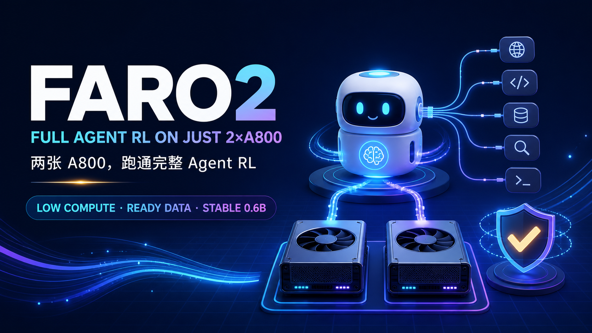
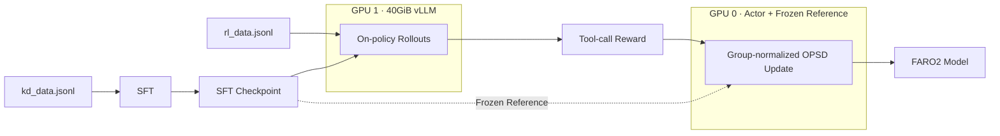

<div align="center">



# FARO2

### 用两张 80GB GPU，完成一套完整、稳定、开箱即用的 Agent RL（OPSD）项目

[English](README_EN.md) | **简体中文**

[](LICENSE)
[](#硬件与显存)
[](#为什么-06b-也能稳定训练)
[](https://huggingface.co/datasets/Camellia86/Full_Agent_RL_OPSD_with_Just_2_A800s)

</div>

## FARO2 是什么？

**FARO2** 取自 **F**ull **A**gent **R**L **O**PSD on **2** GPUs。

如果您：

- 手里没有大规模 GPU 集群；
- 缺少 RL、OPD/OPSD 或分布式训练经验；
- 暂时没有可直接使用的 Agent 工具调用训练数据；
- 但仍然希望真正跑通一次完整的 Agent RL，而不只是看伪代码或最小玩具示例。

您可以选择FARO2。

FARO2 把数据、SFT、在线采样、工具调用 reward、冻结 reference、OPSD 更新、vLLM 权重同步、断点续训和显存记录整理成一条可执行流水线。默认从 Qwen3-0.6B 开始，只需要两张 80GB GPU。

> 项目目标不是把复杂度藏起来，而是提供一个可靠的起点：先低成本跑通，再在此基础上研究更大的模型、更复杂的 Agent 环境和更强的训练目标。

## 为什么是工具调用？

工具调用是 Agent 时代模型的基础能力。一个模型如果不能稳定地：

1. 理解可用工具的 schema；
2. 选择正确的函数；
3. 生成结构合法的参数；
4. 在多工具场景中保持调用顺序与格式；

它就很难进一步完成检索、代码执行、数据库操作、工作流编排或真实环境交互。

FARO2 因此把任务聚焦在工具调用能力上：SFT 先建立格式和任务先验，随后使用 teacher-free OPSD 在模型自己访问到的状态上继续优化。

## 项目亮点

### 1. 低算力：完整 RL 只需两张 80GB GPU

- GPU 0：训练 actor，并与冻结 reference 共置；
- GPU 1：运行单实例 vLLM，默认显存池固定为 40GiB；
- 默认支持 2×A800 80GB、2×H800 80GB 或 2×H200；
- 脚本自动将 40GiB 换算成当前 GPU 对应的 `gpu_memory_utilization`；
- 运行时持续记录两张卡的显存，并用 72GiB 峰值上限验证 A800 可迁移性。

两张 40GB GPU 不支持默认完整配置，因为 vLLM 显存池本身就需要约 40GiB。

### 2. 开箱即用：从下载数据到训练完成

仓库提供：

- 固定版本环境安装脚本；
- SFT 启动脚本；
- 双 GPU OPSD 启动脚本；
- 工具调用 reward；
- 自动断点续训；
- TensorBoard、训练日志、显存轨迹和完成状态文件；
- 面向服务器 Agent 的独立操作手册 [`agent.md`](agent.md)。

### 3. 自带可用数据

完整数据为项目自采数据，需要保留用于论文研究，因此不直接全部公开。Hugging Face 发布版对两份训练文件分别进行了**无放回、精确 `floor(N×0.4)` 的随机抽样**，并保留抽样后的原始行顺序。

| 文件 | 行数 |
|---|---:|
| `kd_data.jsonl` | 429,218 |
| `rl_data.jsonl` | 57,796 |

每行均包含：

```json
{"id": "...", "inputs": "...", "targets": "..."}
```

### 4. 低经验门槛

FARO2 使用 OpenRLHF、Ray、DeepSpeed 与 vLLM，但用户不需要先掌握这些框架的全部细节。常用配置都通过环境变量暴露，默认值可以直接运行；脚本同时执行输入文件检查、GPU 数量检查、模型产物检查和状态落盘。

### 5. 小模型也稳定：0.6B 通常不会轻易训崩

稳定性是 FARO2 的核心设计目标。根据现有 0.6B 工程实践，默认配置通常可以维持正常的 reward、KL 和更新过程，不容易出现突然的策略坍塌。关键保护包括：

- **同源冻结 reference**：SFT checkpoint 同时作为策略初始化与冻结参考；
- **reference KL**：默认 `init_kl_coef=1e-3`，限制策略在一次更新中漂移过远；
- **动态过滤**：过滤奖励全同或退化的 rollout group；
- **group-normalized advantage**：降低不同 prompt 奖励尺度造成的波动；
- **保守学习率**：actor 默认 `3e-7`；
- **梯度裁剪**：沿用 OpenRLHF 默认 `max_norm=1.0`；
- **micro batch=1 与梯度检查点**：在长上下文下保留足够显存余量。

“稳定”不等于任何数据和超参数下都绝对不会失败。FARO2 的承诺是提供经过约束的稳健默认值，并完整保留 `train.log`、TensorBoard 与资源轨迹，便于及时定位异常。

### 6. 可复现的资源证明

OPSD 脚本每 5 秒记录：

- GPU 显存已用/剩余；
- GPU 利用率；
- 每张卡的峰值显存；
- 最终模型与状态 sentinel。

只有模型成功保存且两卡峰值均未超过默认 72GiB，状态才会写为 `COMPLETE_A800_FIT`。

## 训练流程



## 仓库结构

```text
FARO2/
├── assets/
│   └── faro2-hero.png
├── opsd/
│   └── reward.py
├── scripts/
│   ├── setup_env.sh
│   ├── train_sft.sh
│   └── train_opsd_2xa800.sh
├── agent.md
├── LICENSE
├── README.md
├── README_EN.md
└── requirements.txt
```

本仓库只包含训练所需代码和文档，不包含数据文件、训练产物或任务评分脚本。

## 硬件与显存

| 组件 | 默认放置 | 保守预算 |
|---|---|---:|
| Actor + optimizer + frozen reference | GPU 0 | 约 36–48GiB |
| vLLM 权重 + KV cache + workspace | GPU 1 | 40GiB 池，整卡约 46GiB |
| FARO2 验收上限 | 每张卡 | 72GiB |

推荐环境：

- 2×A800 80GB / H800 80GB / H200；
- Python 3.12；
- NVIDIA 驱动支持 CUDA 12.8 wheel；
- Linux；
- 足够的 CPU 内存和共享磁盘用于 Ray 与 checkpoint。

## 快速开始

### 1. 克隆仓库

```bash
git clone https://github.com/Camellia86/Full-Agent-RL-OPSD-with-Just-2-A800s.git FARO2
cd FARO2
```

### 2. 安装环境

```bash
bash scripts/setup_env.sh
source .venv/bin/activate
```

固定依赖包括 OpenRLHF 0.8.9、vLLM 0.10.0、PyTorch 2.7.1、Ray 2.48、DeepSpeed、FlashAttention 与 Transformers。

如果 GPU 服务器不能联网，请在共享文件系统的联网 CPU 节点完成环境和模型下载，再到 GPU 节点启动训练。

### 3. 下载公开数据

PowerShell 安装 Hugging Face CLI：

```powershell
powershell -ExecutionPolicy ByPass -c "irm https://hf.co/cli/install.ps1 | iex"
```

Linux：

```bash
curl -LsSf https://hf.co/cli/install.sh | bash
```

下载数据：

```bash
hf download Camellia86/Full_Agent_RL_OPSD_with_Just_2_A800s \
  --repo-type dataset \
  --local-dir data
```

下载后应包含：

```text
data/kd_data.jsonl
data/rl_data.jsonl
```

<!-- DATASET_STATS_START -->
| 文件 | 公开行数 |
|---|---:|
| `kd_data.jsonl` | 429,218 |
| `rl_data.jsonl` | 57,796 |

抽样采用无放回随机选择，并在抽样后恢复原始行顺序。完整种子、字节数与 SHA-256 见 Hugging Face 中的 `sampling_manifest.json`。
<!-- DATASET_STATS_END -->

数据集地址：<https://huggingface.co/datasets/Camellia86/Full_Agent_RL_OPSD_with_Just_2_A800s>

### 4. 准备基座模型

默认模型为：

```text
Qwen/Qwen3-0.6B
```

联网训练节点可以直接使用 Hugging Face ID。离线节点请先下载到共享目录，并通过 `BASE_MODEL` 传入本地路径。

### 5. 启动 SFT

```bash
GPU_IDS=0,1 \
BASE_MODEL=Qwen/Qwen3-0.6B \
bash scripts/train_sft.sh
```

本地模型示例：

```bash
GPU_IDS=0,1 \
BASE_MODEL=/shared/models/Qwen3-0.6B \
DATA_PATH=data/kd_data.jsonl \
OUTPUT_DIR=outputs/sft \
MAX_EPOCHS=1 \
bash scripts/train_sft.sh
```

成功标志：

```text
outputs/sft/status.txt -> COMPLETE stage=sft
outputs/sft/model.safetensors
```

### 6. 启动 FARO2 OPSD

必须等 SFT 完成后再启动：

```bash
GPU_IDS=0,1 \
SFT_MODEL=outputs/sft \
bash scripts/train_opsd_2xa800.sh
```

默认完整训练形状：

| 配置 | 默认值 |
|---|---:|
| Prompt 最大长度 | 5120 |
| Response 最大长度 | 512 |
| 每个 prompt 的 rollout 数 | 8 |
| Rollout batch | 128 |
| Train batch | 128 |
| Micro train batch | 1 |
| Actor learning rate | 3e-7 |
| Reference KL coefficient | 1e-3 |
| vLLM pool | 40GiB |

## 使用 tmux 后台启动

SFT：

```bash
tmux new-session -d -s faro2-sft \
  "cd $PWD && GPU_IDS=0,1 bash scripts/train_sft.sh"
```

确认 SFT 完成后启动 OPSD：

```bash
tmux new-session -d -s faro2-rl \
  "cd $PWD && GPU_IDS=0,1 SFT_MODEL=outputs/sft bash scripts/train_opsd_2xa800.sh"
```

查看日志：

```bash
tmux attach -t faro2-sft
tmux attach -t faro2-rl
```

## 常用环境变量

| 变量 | 阶段 | 默认值 | 作用 |
|---|---|---|---|
| `GPU_IDS` | 两者 | `0,1` | 两张物理 GPU |
| `BASE_MODEL` | SFT | `Qwen/Qwen3-0.6B` | 基座模型或本地路径 |
| `DATA_PATH` | 两者 | 对应 `data/*.jsonl` | 训练数据路径 |
| `OUTPUT_DIR` | 两者 | `outputs/...` | 输出目录 |
| `MAX_EPOCHS` | SFT | `1` | SFT epoch 数 |
| `SFT_MODEL` | OPSD | `outputs/sft` | SFT checkpoint |
| `NUM_EPISODES` | OPSD | `3` | 在线训练 episode 数 |
| `MAX_SAMPLES` | 两者 | `100000000` | 最大数据条数 |
| `VLLM_TARGET_MIB` | OPSD | `40960` | vLLM 绝对显存池 |
| `A800_CARD_LIMIT_MIB` | OPSD | `73728` | 每卡资源验收上限 |
| `SEED` | 两者 | `42` | 训练随机种子 |

## 输出目录

```text
outputs/
├── sft/
│   ├── model.safetensors
│   ├── status.txt
│   ├── train.log
│   └── tensorboard/
└── faro2_qwen3_0p6b_s42/
    ├── model.safetensors
    ├── status.txt
    ├── train.log
    ├── run_config.txt
    ├── resource_trace.csv
    ├── resource_peak.tsv
    ├── tensorboard/
    └── trainer_state/
```

## 推荐测评

完成训练后，建议 follow 本项目的用户使用 **ACEBench** 复核模型的工具调用能力。FARO2 仓库保持 training-only，不重复打包其测评实现。

ACEBench 官方项目：<https://github.com/chenchen0103/ACEBench>

## 稳定性建议

如果训练出现异常：

1. 先确认没有其他进程在训练过程中抢占两张 GPU；
2. 保留 reference KL、动态过滤和默认学习率，不要一次修改多个关键项；
3. 显存不足时优先减小 `micro_train_batch_size` 或上下文长度；
4. 检查 `train.log` 中 reward、KL、response length 和 filtering pass rate；
5. 使用现有 `trainer_state` 断点恢复，不要删除已有 checkpoint 后盲目重跑。

## 数据发布说明

公开数据仅用于让缺少数据的用户能够完整复现训练流水线。完整自采语料未包含在 Hugging Face 或 GitHub 中。公开抽样的种子、行数、字节数和 SHA-256 均记录在 `sampling_manifest.json`。

## License

FARO2 采用 [MIT License](LICENSE)。第三方依赖仍遵循其各自许可证。

## Citation

如果 FARO2 对你的研究或工程有帮助，可以引用：

```bibtex
@software{faro2_2026,
  title  = {FARO2: Full Agent RL OPSD on Just Two 80GB GPUs},
  author = {Camellia86},
  year   = {2026},
  url    = {https://github.com/Camellia86/Full-Agent-RL-OPSD-with-Just-2-A800s}
}
```

## Acknowledgements

FARO2 基于 OpenRLHF、vLLM、Ray、DeepSpeed、Hugging Face 与 Qwen 生态构建。感谢这些开源项目提供的基础设施。
