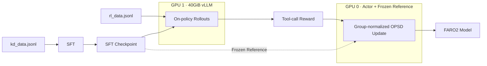

<div align="center">


# FARO2

### A complete, stable, ready-to-run Agent RL (OPSD) project on two 80GB GPUs

**English** | [简体中文](README.md)

[](LICENSE)
[](#hardware-and-memory)
[](#stable-even-at-06b)
[](https://huggingface.co/datasets/Camellia86/Full_Agent_RL_OPSD_with_Just_2_A800s)

</div>

## What is FARO2?

**FARO2** stands for **F**ull **A**gent **R**L **O**PSD on **2** GPUs.

If you want to complete a real Agent RL project but have limited compute, limited RL/OPD experience, or no ready-to-use tool-calling data, you can choose FARO2. It packages data, SFT, online rollout generation, tool-calling rewards, a frozen reference, OPSD updates, vLLM weight synchronization, checkpoint recovery, and memory tracing into one executable pipeline.

The default recipe starts from Qwen3-0.6B and requires only two 80GB GPUs.

> FARO2 provides a reliable low-cost starting point: make the complete pipeline work first, then scale the model, environment, and learning objective.

## Why tool calling?

Tool calling is a foundational capability for modern agents. A useful agent must understand tool schemas, select the right function, produce valid arguments, and preserve structure across multi-tool tasks. These skills underpin retrieval, code execution, database access, workflow orchestration, and interaction with external environments.

FARO2 therefore focuses on tool calling. SFT establishes the task and formatting prior; teacher-free OPSD then improves the policy on states visited by the model itself.

## Highlights

### 1. Low compute: full Agent RL on two 80GB GPUs

- GPU 0 colocates the trainable actor and frozen reference.
- GPU 1 runs one vLLM engine with an absolute 40GiB pool.
- The default target supports 2×A800 80GB, 2×H800 80GB, or 2×H200.
- The launcher converts 40GiB into the correct `gpu_memory_utilization` for the detected cards.
- Continuous memory tracing verifies that each card stays below the default 72GiB A800 portability ceiling.

Two 40GB cards are not supported by the default full-shape recipe because the vLLM pool alone needs approximately 40GiB.

### 2. Ready to run

The repository includes a pinned environment installer, SFT launcher, two-GPU OPSD launcher, tool-calling reward, checkpoint resume, TensorBoard logs, memory traces, status sentinels, and a dedicated server-agent runbook in [`agent.md`](agent.md).

### 3. Usable public data

The complete internally collected corpus is retained for research publication. The Hugging Face release contains an exact uniform sample without replacement using `floor(N × 0.4)` rows from each training file, with original row order restored afterward.

| File | Rows |
|---|---:|
| `kd_data.jsonl` | 429,218 |
| `rl_data.jsonl` | 57,796 |

Every JSONL row contains `id`, `inputs`, and `targets`.

### 4. Low experience barrier

FARO2 uses OpenRLHF, Ray, DeepSpeed, and vLLM, but users do not need to master all four systems before starting. The most important controls are exposed as environment variables, while launchers validate data paths, GPU count, model artifacts, checkpoint state, and completion status.

### 5. Stable even at 0.6B

Stability is a first-class design goal. In existing 0.6B engineering runs, the default recipe generally maintains healthy reward, KL, and update behavior instead of abruptly collapsing. The safeguards are:

- the same SFT checkpoint initializes the policy and frozen reference;
- a reference KL term with `init_kl_coef=1e-3`;
- dynamic filtering for degenerate rollout groups;
- group-normalized advantages;
- a conservative actor learning rate of `3e-7`;
- OpenRLHF's default `max_norm=1.0` gradient clipping;
- micro batch 1 and gradient checkpointing for long-context headroom.

Stability is not an absolute guarantee for arbitrary data and hyperparameters. FARO2 instead provides constrained defaults and preserves the logs needed to catch abnormal behavior early.

### 6. Reproducible resource evidence

The OPSD launcher samples memory every five seconds and writes per-card peaks. A run receives the `COMPLETE_A800_FIT` sentinel only if the final model exists and neither card exceeds the default 72GiB observed-memory ceiling.

## Pipeline



## Repository layout

```text
FARO2/
├── assets/faro2-hero.png
├── opsd/reward.py
├── scripts/setup_env.sh
├── scripts/train_sft.sh
├── scripts/train_opsd_2xa800.sh
├── agent.md
├── LICENSE
├── README.md
├── README_EN.md
└── requirements.txt
```

The repository contains training code and documentation only. Data files and generated checkpoints are not committed.

## Hardware and memory

| Component | Default placement | Conservative budget |
|---|---|---:|
| Actor, optimizer, frozen reference | GPU 0 | approximately 36–48GiB |
| vLLM weights, KV cache, workspace | GPU 1 | 40GiB pool; approximately 46GiB total |
| FARO2 acceptance ceiling | each card | 72GiB |

Recommended system: two A800 80GB, H800 80GB, or H200 GPUs; Linux; Python 3.12; an NVIDIA driver compatible with CUDA 12.8 wheels; and shared storage for data and checkpoints.

## Quick start

### 1. Clone

```bash
git clone https://github.com/Camellia86/Full-Agent-RL-OPSD-with-Just-2-A800s.git FARO2
cd FARO2
```

### 2. Install

```bash
bash scripts/setup_env.sh
source .venv/bin/activate
```

The pinned stack includes OpenRLHF 0.8.9, vLLM 0.10.0, PyTorch 2.7.1, Ray 2.48, DeepSpeed, FlashAttention, and Transformers.

If the GPU host has no internet access, perform environment and model downloads on an internet-enabled CPU host that shares the same filesystem.

### 3. Download the public data

PowerShell:

```powershell
powershell -ExecutionPolicy ByPass -c "irm https://hf.co/cli/install.ps1 | iex"
```

Linux:

```bash
curl -LsSf https://hf.co/cli/install.sh | bash
```

```bash
hf download Camellia86/Full_Agent_RL_OPSD_with_Just_2_A800s \
  --repo-type dataset \
  --local-dir data
```

Expected files:

```text
data/kd_data.jsonl
data/rl_data.jsonl
data/sampling_manifest.json
```

Dataset: <https://huggingface.co/datasets/Camellia86/Full_Agent_RL_OPSD_with_Just_2_A800s>

### 4. Run SFT

```bash
GPU_IDS=0,1 \
BASE_MODEL=Qwen/Qwen3-0.6B \
bash scripts/train_sft.sh
```

For an offline model, use a path relative to the repository root and adjust it to match your layout:

```bash
GPU_IDS=0,1 \
BASE_MODEL=../models/Qwen3-0.6B \
DATA_PATH=data/kd_data.jsonl \
OUTPUT_DIR=outputs/sft \
MAX_EPOCHS=1 \
bash scripts/train_sft.sh
```

Required completion artifacts:

```text
outputs/sft/status.txt -> COMPLETE stage=sft
outputs/sft/model.safetensors
```

### 5. Run FARO2 OPSD

Start only after SFT completes:

```bash
GPU_IDS=0,1 \
SFT_MODEL=outputs/sft \
bash scripts/train_opsd_2xa800.sh
```

Default full shape:

| Setting | Value |
|---|---:|
| Maximum prompt length | 5120 |
| Maximum response length | 512 |
| Rollouts per prompt | 8 |
| Rollout batch | 128 |
| Train batch | 128 |
| Micro train batch | 1 |
| Actor learning rate | 3e-7 |
| Reference KL coefficient | 1e-3 |
| vLLM pool | 40GiB |

## Detached tmux launch

```bash
tmux new-session -d -s faro2-sft -c "$PWD" \
  "GPU_IDS=0,1 bash scripts/train_sft.sh"
```

After SFT completes:

```bash
tmux new-session -d -s faro2-rl -c "$PWD" \
  "GPU_IDS=0,1 SFT_MODEL=outputs/sft bash scripts/train_opsd_2xa800.sh"
```

## Key environment variables

| Variable | Stage | Default | Purpose |
|---|---|---|---|
| `GPU_IDS` | both | `0,1` | two physical GPUs |
| `BASE_MODEL` | SFT | `Qwen/Qwen3-0.6B` | base model or local path |
| `DATA_PATH` | both | matching `data/*.jsonl` | training data |
| `OUTPUT_DIR` | both | under `outputs/` | output directory |
| `MAX_EPOCHS` | SFT | `1` | SFT epochs |
| `SFT_MODEL` | OPSD | `outputs/sft` | SFT checkpoint |
| `NUM_EPISODES` | OPSD | `3` | online episodes |
| `MAX_SAMPLES` | both | `100000000` | sample limit |
| `VLLM_TARGET_MIB` | OPSD | `40960` | absolute vLLM pool |
| `A800_CARD_LIMIT_MIB` | OPSD | `73728` | per-card acceptance ceiling |
| `SEED` | both | `42` | training seed |

## Outputs

```text
outputs/
├── sft/
│   ├── model.safetensors
│   ├── status.txt
│   ├── train.log
│   └── tensorboard/
└── faro2_qwen3_0p6b_s42/
    ├── model.safetensors
    ├── status.txt
    ├── train.log
    ├── run_config.txt
    ├── resource_trace.csv
    ├── resource_peak.tsv
    ├── tensorboard/
    └── trainer_state/
```

## Recommended evaluation

After training, followers are encouraged to use **ACEBench** to assess the model's tool-calling capability. FARO2 remains training-only and does not duplicate its evaluation implementation.

Official ACEBench project: <https://github.com/chenchen0103/ACEBench>

## Stability checklist

If training becomes abnormal:

1. verify that no other process started consuming the selected GPUs;
2. retain the reference KL, dynamic filtering, and conservative learning rate;
3. reduce micro-batch size or context length first when memory is insufficient;
4. inspect reward, KL, response length, and filtering pass rate in `train.log`;
5. resume from `trainer_state` instead of deleting checkpoints and restarting blindly.

## Data release policy

The public subset enables users without proprietary data to run the complete pipeline. The full internally collected corpus is not included on GitHub or Hugging Face. Sampling seeds, counts, byte sizes, and SHA-256 values are recorded in `sampling_manifest.json`.

## License

FARO2 is released under the [MIT License](LICENSE). Third-party dependencies retain their respective licenses.

## Citation

```bibtex
@software{faro2_2026,
  title  = {FARO2: Full Agent RL OPSD on Just Two 80GB GPUs},
  author = {Camellia86},
  year   = {2026},
  url    = {https://github.com/Camellia86/Full-Agent-RL-OPSD-with-Just-2-A800s}
}
```

## Acknowledgements

FARO2 builds on OpenRLHF, vLLM, Ray, DeepSpeed, Hugging Face, and the Qwen ecosystem. We thank these open-source projects for their infrastructure.
